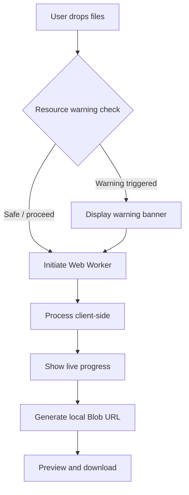

# Konbato - Product Requirements Document (PRD)

**v1.6 - 100% Client-Side Image & PDF Tools Suite**

---

## 1. Executive Summary

### Problem Statement

Modern file manipulation utilities process files by uploading them to remote servers. This creates privacy risk for sensitive documents, adds artificial file-size limits, consumes bandwidth, and often requires accounts for basic tasks.

### Proposed Solution

Konbato is a Next.js web application for image and PDF conversion, compression, and editing that runs entirely in the user's browser. Files are processed through WebAssembly, Canvas APIs, and Web Workers without uploading user file bytes to a server.

- **Zero server uploads**: User file bytes stay on the device.
- **Zero sign-up/accounts**: Tools are instantly available.
- **Privacy-first processing**: No server-side file handling.

### Success Criteria

1. **Zero data leaks**: No user file contents are transmitted over the network.
2. **Sub-second image processing**: Standard images under 10 MB convert or compress in less than 1 second on mid-tier hardware.
3. **High-performance PDF editing**: Merge, split, reorder, or scrub metadata from standard PDFs under 50 pages in under 3 seconds on mid-tier hardware.
4. **Responsive UI during processing**: The main interface remains usable while workers process files.
5. **Practical privacy scrubbing**: Image and PDF metadata removal clears common embedded metadata while documenting that it is not forensic sanitization.
6. **Fast first visit**: Landing page passes Lighthouse Core Web Vitals with a performance score above 90.

---

## 2. User Experience & Functionality

### User Personas

- **Privacy-sensitive office worker**: Handles contracts, medical records, tax documents, or financial statements and cannot upload files to third-party servers.
- **Digital designer / web developer**: Batch-converts and compresses image assets without paywalls or account creation.
- **On-the-go professional / student**: Merges PDFs, extracts pages, rotates scans, or converts images quickly on a laptop or mobile device.

### User Flow



### Epic 1: Unified Image Converter

**Story**: As a designer, I want to upload batch images and convert them to PNG, JPG, or WebP so I can optimize assets locally.

**Acceptance Criteria**

- Supports batch upload.
- Supports JPEG, PNG, WebP, GIF, and TIFF input.
- Supports PNG, JPG, and WebP output.
- Exports individual files or a ZIP for batch output.

### Epic 2: Image Editing & Compression

**Story**: As a web developer, I want to compress, resize, crop, and scrub images so I can prepare assets locally.

**Acceptance Criteria**

- Quality slider controls output quality.
- Optional width and height resizing is supported.
- Resize and crop supports preset aspect ratios and numeric crop bounds.
- Image metadata removal re-encodes visible pixels to remove common EXIF/GPS/software metadata.
- Processing runs off the main UI thread.
- Output can be previewed and downloaded.

### Epic 3: Client-Side Background Removal

**Story**: As an e-commerce seller, I want to remove image backgrounds locally and export transparent PNGs.

**Acceptance Criteria**

- Runs a browser-side segmentation model.
- No uploaded image bytes are sent to a server.
- First-run model loading is clearly indicated.
- Output is a transparent PNG with no watermark.

### Epic 4: PDF Document Tools

**Story**: As a user handling confidential documents, I want to merge, split, reorder, compress, rotate, scrub metadata, and convert PDFs locally.

**Acceptance Criteria**

- PDF merge supports multiple documents and page ordering.
- PDF split supports selected page extraction.
- PDF reorder supports drag-based page sequencing for one source document.
- PDF compress supports light and deep modes.
- PDF metadata removal clears common document information fields such as title, author, creator, producer, and dates.
- PDF rotate saves rotated pages.
- PDF to image exports page images.
- Image to PDF compiles uploaded images into a readable PDF.

### Non-Goals

- **Office to PDF**: DOCX/XLSX/PPTX to PDF is out of scope because client-side office rendering is large and unreliable.
- **Cloud storage integration**: Google Drive, Dropbox, and similar integrations require cloud tokens and network access.
- **User accounts**: No profile, login, or account database will be developed.
- **Offline PWA mode**: Service worker installation and offline caching are deferred.
- **OCR**: Text extraction from scanned PDFs/images is deferred.
- **Video processing**: Video trimming, compression, conversion, and audio extraction are deferred to a future plan.

---

## 3. Technical Specifications

### Architecture

```text
Browser
  Main UI Thread
    React state, routing, previews, controls
  Worker Layer
    Image Worker - Canvas API, OffscreenCanvas, UTIF
    PDF Worker - MuPDF
  UI Utilities
    PDF.js - page thumbnails and previews
```

### Library Stack

1. **PDF processing**: MuPDF.js for merge, split, rotate, compression, and document creation.
2. **PDF rendering**: PDF.js for page previews and render-to-canvas workflows.
3. **Image processing**: Canvas and OffscreenCanvas for conversion, compression, resize/crop, metadata scrubbing, and encoding.
4. **TIFF support**: UTIF.js for TIFF decode.
5. **Background removal**: `@imgly/background-removal`.
6. **Archive packaging**: JSZip for batch downloads.

### Security & Privacy Invariants

- User file bytes must not be uploaded.
- Workers must operate on in-memory buffers and return Blob URLs for download.
- Any model or WASM asset download must be clearly separated from user file data.
- Network tests should verify that tool operations do not send file payloads.

### Device Resource Detection

Low-memory systems can freeze if large buffers are allocated. Konbato should classify risk using `navigator.deviceMemory` and `navigator.hardwareConcurrency` where available.

| Class | Profile Criteria | Guidance |
| --- | --- | --- |
| Low-end | RAM <= 2 GB or CPU cores <= 2 | Warn before large images, large PDFs, or multi-file batches. |
| Mid-end | RAM <= 4 GB or CPU cores <= 4 | Warn for large PDF/image batches. |
| High-end | RAM > 4 GB and CPU cores > 4 | Warn only for unusually large files or high page counts. |

---

## 4. Risks

1. **Browser memory pressure**
   - Risk: Large PDFs or high-resolution image batches can exceed browser memory.
   - Mitigation: Warn users, process in workers, release object URLs, and avoid unnecessary buffer copies.

2. **First-load latency**
   - Risk: PDF WASM and background-removal model assets can be large.
   - Mitigation: Lazy-load heavy assets only on the relevant tool page.

3. **Browser compatibility**
   - Risk: Some image formats or worker APIs may differ across Chromium, WebKit, and Firefox.
   - Mitigation: Use capability checks, browser-specific fallbacks, and Playwright coverage for supported browsers.

---

## 5. Roadmap

### Phase 1: Image Suite & Core Infrastructure

- Web Worker hook and message schema.
- Image conversion.
- Image compression and resizing.
- Image resize and crop.
- Image metadata remover.
- Background removal.
- Tools directory and resource warnings.

### Phase 2: PDF Suite

- PDF merge.
- PDF split.
- PDF compression.
- PDF rotation.
- PDF metadata remover.
- PDF page reorder.
- PDF to image.
- Image to PDF.

### Phase 3: Image/PDF Polish & Advanced Formats

- AVIF capability checks and fallback strategy.
- Better image/PDF previews.
- Batch download refinements.
- Better error states and resource warnings.
- Accessibility and responsive layout polish.

---

## 6. Future Plan: Deferred Video Processing

Video tools are not part of the active product scope. They may be revisited after image and PDF workflows are stable.

Future investigation should validate:

- FFmpeg.wasm bundle size and first-load impact.
- Whether COOP/COEP headers are acceptable for deployment.
- Browser memory limits for realistic source videos.
- Whether a narrow trim-only MVP using stream copy is useful enough before adding compression/transcoding.

Potential future video tools:

- Trim video.
- Compress video.
- Convert video container/codec.
- Extract audio.

---

## 7. Verification Plan

### Automated Verification

- Playwright tests for core image and PDF workflows.
- Network interception tests that confirm no file payloads are uploaded.
- Browser-specific coverage for Chromium and WebKit.
- Unit tests for page-range parsing and resource classifiers.

### Manual Verification

1. Run image conversion and PDF merge with DevTools Network open and confirm no file payloads leave the browser.
2. Compare PDF outputs against originals for page order, rotation, readability, and file size.
3. Track browser memory during large PDF/image operations and verify object URLs are released after reset/download.
