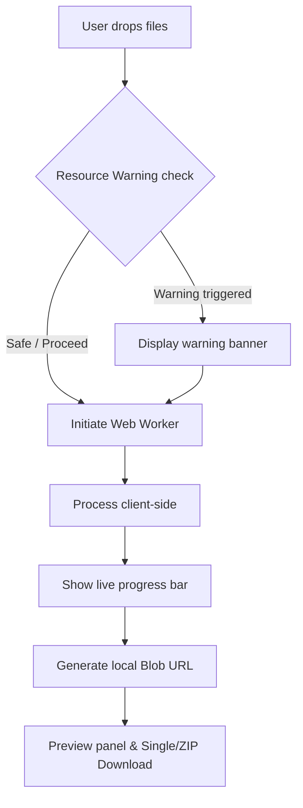

# Konbato — Product Requirements Document (PRD)
**v1.4 — 100% Client-Side File Tools Suite**

---

## 1. Executive Summary

### Problem Statement
Modern file manipulation utilities (e.g., *ilovepdf*, *Smallpdf*, *Convertio*) process files by uploading them to remote servers. This architecture introduces severe data privacy risks for sensitive documents (contracts, medical records, financial statements), enforces artificial file-size limits, consumes unnecessary bandwidth, requires user accounts for basic tasks, and exposes user data to third-party handlers. No mainstream, feature-rich tool runs entirely on the client's browser.

### Proposed Solution
**Konbato** (コンバート / Convert) is a Next.js web application providing an all-in-one suite of file conversion, compression, and editing tools that run **100% client-side**. By utilizing modern browser capabilities including **WebAssembly (WASM)**, the **Canvas API**, and **Web Workers**, Konbato processes files directly in the user's browser memory.
- **Zero server uploads**: No file bytes ever leave the client's device.
- **Zero sign-up/accounts**: Free and instantly available to all users.
- **Zero analytics/telemetry**: Absolute privacy by design.

### Success Criteria (KPIs)
1. **Zero Data Leaks**: $0\text{ B}$ of user file contents transmitted over the network (validated via automated Content Security Policy blocks and network profiling).
2. **Sub-second Image Processing**: Convert or compress standard images ($< 10\text{ MB}$) in less than $1.0\text{ second}$.
3. **High-Performance PDF Editing**: Merge or split standard PDF files ($< 50\text{ pages}$) in under $3.0\text{ seconds}$.
4. **Acceptable Local Encoding Latency**: Compress a $100\text{ MB}$ video file in under $45\text{ seconds}$ on mid-tier hardware.
5. **Zero Main Thread Jank**: Maintain $60\text{ FPS}$ UI responsive performance during high-throughput file compression through dedicated off-thread Web Workers.
6. **High First-Visit Page Load**: Pass Google Lighthouse Core Web Vitals ($> 90$ performance score for landing page).

---

## 2. User Experience & Functionality

### User Personas
- **Privacy-Sensitive Office Worker (e.g., Legal, Healthcare, Finance)**: Handles highly confidential documents (tax sheets, patient intake forms, NDAs). Requires instant utility but is legally and ethically barred from uploading files to third-party servers.
- **Digital Designer / Web Developer**: Frequently needs to batch-convert formats (e.g., PNG/TIFF to WebP/AVIF) or compress assets. Desires a clean, fast UI without paywalls or account creation.
- **On-the-Go Professional / Student**: Needs to merge lectures, trim short videos, or sign/split PDFs quickly on a laptop or mobile device.

### User Stories & Acceptance Criteria



#### Epic 1: Unified Image Converter (Highest Development Priority)
* **Story**: As a designer, I want to upload batch images (JPG, PNG, WEBP, GIF, TIFF) and convert them to PNG, JPG, or WEBP with a preview slider so I can optimize my assets locally.
* **Acceptance Criteria**:
  * Supports bulk upload of up to $50$ files.
  * Target format selector dropdown (PNG, JPG, WEBP).
  * Real-time before/after visual comparison slider.
  * Supports importing JPEG, PNG, WebP, GIF, TIFF.
  * Exports individual files or bundles them into a single `.zip` file client-side.

#### Epic 2: Client-Side Background Removal (Image Suite)
* **Story**: As an e-commerce seller, I want to remove backgrounds from product photos for free at full resolution.
* **Acceptance Criteria**:
  * Runs a machine learning segmentation model directly in the browser via WebAssembly (ONNX Runtime).
  * 100% client-side execution; zero image bytes or pixels are sent to any API or external server.
  * First-run indicates download progress of the segmentation weights (~$25\text{–}50\text{ MB}$).
  * Outputs full-resolution transparent PNG with no watermark.

#### Epic 3: PDF Document Manipulation (Medium Development Priority)
* **Story**: As a financial controller, I want to merge, split, and compress tax documents without uploading them.
* **Acceptance Criteria**:
  * PDF Merge: Visual interface to drag, drop, and reorder document page sequences.
  * PDF Split: Specify custom page ranges (e.g., `1-3, 5, 8-12`) with live thumbnail validation.
  * PDF Compress: Offers two levels:
    * *Light*: Strips metadata, structural duplication, and unused fonts (lossless vector).
    * *Deep*: Downsamples and re-compresses embedded image assets (with warning: flattens vector text to images).

#### Epic 4: Video Transcoding & Trim (Lowest Development Priority)
* **Story**: As a content creator, I want to trim, compress, and convert a recorded video to MP4/WebM.
* **Acceptance Criteria**:
  * Trim tool features a dual-slider timeline picker showing timestamp markers.
  * Transcodes between MP4, WebM, AVI, and MOV.
  * Option to extract audio tracks directly to MP3.

### Non-Goals
* **Office to PDF (DOCX/XLSX/PPTX to PDF)**: Client-side LibreOffice WASM builds are too large ($> 150\text{ MB}$ download) and yield poor rendering accuracy. Out of scope; will prompt a warning to users.
* **Cloud Storage Integration**: Storing files in Google Drive/Dropbox requires cloud tokens and server interactions, contradicting the zero-network footprint promise.
* **Social Media Sign-in / User Database**: No user database, profiles, or login forms will be developed.
* **Offline Service Worker / PWA Caching**: Caching for offline execution and service-worker installation is deferred to later phases.
* **Optical Character Recognition (OCR)**: Text extraction from scanned PDFs/images is deferred.

---

## 3. Local Machine Learning Requirements (Background Removal)

### Model & Engine Details
* **Segmentation Engine**: `@imgly/background-removal` running `ONNX Runtime Web` (WASM).
* **Model Profile**: Runs a local, pre-trained neural network segmentation model (U²-Net or MobileNet-equivalent) directly inside the browser sandbox.
* **Memory Limits**: The model requires ~ $100\text{ MB}$ of browser heap memory during execution.
* **Latency**: First-run loads model weights (~$25\text{–}50\text{ MB}$) directly from the CDN/public folder into browser memory, showing a progress spinner. Subsequent operations are executed instantly in-memory.

### Evaluation & Optimization Strategy
* **Performance Check**: The system must run a warm-up inference cycle upon loading the background removal tool page.
* **Hardware Acceleration**: Use WASM SIMD / WebGL threads where supported. Check client capability dynamically:
  ```js
  const isWebAssemblySupported = typeof WebAssembly === "object";
  const isWebGLSupported = !!document.createElement('canvas').getContext('webgl');
  ```

---

## 4. Technical Specifications

### System Architecture
The application is structured as a static Single Page Application (SPA) built using Next.js (App Router), deployed as a static export, running entirely in the user's browser sandbox.

```
+--------------------------------------------------------------------------+
|                              Browser Window                              |
|                                                                          |
|  +--------------------------------------------------------------------+  |
|  |                          Main UI Thread                            |  |
|  |  [React Engine] -- [State Manager] -- [Device Resource Profiler]    |  |
|  |         |                                                          |  |
|  +---------|----------------------------------------------------------+  |
|            | Message passing                                             |
|            v (Comlinks / Worker API)                                     |
|  +--------------------------------------------------------------------+  |
|  |                         Web Worker Pool                            |  |
|  |                                                                    |  |
|  |  +--------------------------------------------------------------+  |
|  |  |                         Image Worker                         |  |
|  |  | - Canvas API / UTIF.js                                       |  |
|  |  +--------------------------------------------------------------+  |
|  |  |                          PDF Worker                          |  |
|  |  | - MuPDF.js / PDF.js                                          |  |
|  |  +--------------------------------------------------------------+  |
|  |  |                         Video Worker                         |  |
|  |  | - FFmpeg.wasm (SharedArrayBuffer)                            |  |
|  |  +--------------------------------------------------------------+  |
|  +--------------------------------------------------------------------+  |
+--------------------------------------------------------------------------+
```

### Library Stack & WASM Assets
Rather than using server-side dependencies or standard Node scripts, client-compatible browser ports are loaded dynamically:

1. **PDF Processing**: `MuPDF.js` (Artifex WASM port) replaces abandoned `pdf-lib` for full editing, merging, splitting, and vector manipulation.
2. **PDF Viewer / Render-to-Canvas**: `PDF.js` (v6.x, Mozilla).
3. **Video / Audio Processing**: `@ffmpeg/ffmpeg` (FFmpeg.wasm v0.12+) using `SharedArrayBuffer` for multi-threaded compilation.
4. **Image Compression**: `browser-image-compression` for Canvas-based quality compression and scaling.
5. **Background Removal**: `@imgly/background-removal` (ONNX Runtime WASM).
6. **Archive Packaging**: `JSZip` to wrap batch processing output.

### Security, Headers & Sandbox Invariants
For multi-threaded FFmpeg.wasm to compile, `SharedArrayBuffer` must be active. This requires serving the application with specific HTTP headers:
* `Cross-Origin-Opener-Policy: same-origin`
* `Cross-Origin-Embedder-Policy: require-corp`

#### Content Security Policy (CSP)
To mathematically guarantee that no user data is leaked to external servers, we enforce a strict CSP directive in our HTML headers:
```html
<meta http-equiv="Content-Security-Policy" content="
  default-src 'self';
  script-src 'self' 'unsafe-eval' 'unsafe-inline' blob:;
  style-src 'self' 'unsafe-inline';
  img-src 'self' data: blob:;
  connect-src 'self' https://huggingface.co https://cdn.jsdelivr.net;
  worker-src 'self' blob:;
  wasm-src 'self' blob:;
  object-src 'none';
">
```

### Device Resource Detection
Low-memory systems can freeze if large buffers are allocated. We classify devices using the navigator memory profile:

| Class | Profile Criteria | Max Video File | Action |
|---|---|---|---|
| **Low-End** | RAM $\le 2\text{ GB}$ OR CPU Cores $\le 2$ | $50\text{ MB}$ | Surface persistent banner: "Your device has limited memory. Processing large files may cause browser tabs to crash." |
| **Mid-End** | RAM $\le 4\text{ GB}$ OR CPU Cores $\le 4$ | $200\text{ MB}$ | Warning banner for files $> 150\text{ MB}$. |
| **High-End** | RAM $> 4\text{ GB}$ AND CPU Cores $> 4$ | $500\text{ MB}$ | Warn only for extremely large files ($> 400\text{ MB}$). |

---

## 5. Risks & Technical Vulnerabilities

1. **SharedArrayBuffer Headers (COOP/COEP)**:
   * *Risk*: These headers disable cross-origin iframe embedding and restrict third-party font/asset CDNs.
   * *Mitigation*: Bundle all fonts and SVG icons locally inside the Next.js `public/` directory. No external iframes are needed since the app is analytics-free.
2. **Browser Tab Crashes (OOM)**:
   * *Risk*: V8 engine heap limit on Chrome is typically $4\text{ GB}$ on 64-bit systems. Video/PDF buffers exceeding this threshold cause direct tab closure.
   * *Mitigation*: Stream processing where possible; alert users of high memory consumption; use Web Workers to isolate memory spaces from the main DOM thread.
3. **First-Load Latency**:
   * *Risk*: Downloading $\approx 40\text{ MB}$ of combined WASM binaries and AI weights on poor cellular connections can take minutes.
   * *Mitigation*: Progressive lazy loading. Load FFmpeg.wasm only on `/tools/video/*` pages; load the background removal model only on `/tools/image/remove-bg`. Implement progressive loading indicators.

---

## 6. Phased Roadmap & Step-by-Step Task Breakdown

Development and testing follows the strict dependency sequence: **Image Tools $\rightarrow$ PDF Tools $\rightarrow$ Video Tools**.

```
Phase 1: Core Foundation & Image Tools (Highest Priority)
 ├── Web Worker Pool System
 ├── Basic Image Tools (Compress, Convert, Resize)
 └── Background Removal (Local Client-Side ML)
Phase 2: PDF Document Tools (Medium Priority)
 ├── PDF Merge & Split UI
 ├── Page rotation UI
 └── PDF Compress (Light vs. Deep Rasterization)
Phase 3: Video Transcoding Tools & Polish (Lowest Priority)
 ├── COOP/COEP Multi-threading Config
 ├── Video Compress & Trim (FFmpeg.wasm)
 ├── Audio Extractor
 └── Preview Panels & Download Packaging
```

---

### Phase 1: Image Suite & Core Infrastructure

#### Task 1.1: Web Worker Infrastructure Setup
* **Objective**: Scaffold the Web Worker manager to delegate CPU-intensive file operations away from the main UI thread.
* **Implementation Steps**:
  1. Create a dynamic Web Worker hook: [useWorker.ts](file:///c:/Users/Feildrix/Project/konbato/lib/hooks/useWorker.ts) utilizing Comlink or standard Worker messaging.
  2. Implement a message orchestration schema supporting `PROGRESS`, `SUCCESS`, and `ERROR` event types.
  3. Set up the file structure:
     * [image.worker.ts](file:///c:/Users/Feildrix/Project/konbato/app/workers/image.worker.ts)
* **Acceptance Criteria**:
  * An array buffer sent to the worker returns processed output.
  * Main UI thread continues to render at $60\text{ FPS}$ during execution.

#### Task 1.2: Unified Image Format Conversion (JPG/PNG/WEBP/GIF/TIFF)
* **Objective**: Write client-side conversions using the Canvas API for native web formats and UTIF.js for TIFF images, allowing users to choose output formats.
* **Implementation Steps**:
  1. In [image.worker.ts](file:///c:/Users/Feildrix/Project/konbato/app/workers/image.worker.ts), build an image loader that reads a file Blob and paints it onto an `OffscreenCanvas`.
  2. For TIFF files, import `UTIF.js` inside the worker to decode the raw bytes and paint the bitmap array buffer.
  3. Export using `OffscreenCanvas.convertToBlob({ type: targetMimeType })` matching user format dropdown selection (JPG, PNG, WEBP).
* **Acceptance Criteria**:
  * Convert any combination of `.jpg`, `.png`, `.webp`, `.tiff`, and `.gif` files to `.webp`, `.png`, or `.jpg`.
  * Batch output generates a download `.zip` using `JSZip` if multiple files are loaded.

#### Task 1.3: Image Compression & Dimension Slider
* **Objective**: Build image size optimization using canvas sub-sampling and browser-image-compression.
* **Implementation Steps**:
  1. Set up options UI in [components/sections/image-compress.tsx](file:///c:/Users/Feildrix/Project/konbato/components/sections/image-compress.tsx) with a quality range slider ($1\text{–}100$) and max width/height pixel inputs.
  2. Pass configuration options directly to the image worker.
  3. Run the processing stream through `browser-image-compression` library.
* **Acceptance Criteria**:
  * $5\text{ MB}$ raw image is compressed to under $500\text{ KB}$ at quality level $75$.
  * Visual before/after slider displays compressed artifacts.

#### Task 1.4: Client-Side ML Background Remover
* **Objective**: Integrate `@imgly/background-removal` to remove image backgrounds with zero server calls.
* **Implementation Steps**:
  1. Create the page route [app/tools/image-remove-bg/page.tsx](file:///c:/Users/Feildrix/Project/konbato/app/tools/image-remove-bg/page.tsx).
  2. Initialize the background remover module.
  3. Build a loading overlay in the UI showing model load progress ("Loading AI Model...").
* **Acceptance Criteria**:
  * User uploads a photo; backgrounds are correctly isolated and transparent.
  * No network requests for image analysis occur after weight load.

#### Task 1.5: General Layout & Resource Warning Setup
* **Objective**: Create resource detection warning banners and establish the tools layout.
* **Implementation Steps**:
  1. Create [components/device-warning.tsx](file:///c:/Users/Feildrix/Project/konbato/components/device-warning.tsx) using `navigator.deviceMemory` and `navigator.hardwareConcurrency`.
  2. Build search-enabled tools directory page at `/tools`.
* **Acceptance Criteria**:
  * Warning banner appears when low RAM ($< 4\text{ GB}$) is detected and a large file is uploaded.

---

### Phase 2: PDF Suite (Medium Priority)

#### Task 2.1: PDF Merging Utility
* **Objective**: Build the PDF merger using MuPDF.js WASM to concatenate files.
* **Implementation Steps**:
  1. Set up [pdf.worker.ts](file:///c:/Users/Feildrix/Project/konbato/app/workers/pdf.worker.ts) loading the MuPDF WASM module.
  2. Implement the merge routine: load multiple document arrays, compile them into a single MuPDF document context, and export as a new PDF.
  3. Build a drag-and-drop sortable thumbnail layout using `@dnd-kit/core` in [components/sections/pdf-merge.tsx](file:///c:/Users/Feildrix/Project/konbato/components/sections/pdf-merge.tsx).
* **Acceptance Criteria**:
  * Drop $3$ PDF files, drag thumbnails to change sequence, click merge, receive compiled file.
  * Links, fonts, and vector elements are maintained in the output file.

#### Task 2.2: PDF Page Splitting
* **Objective**: Allow users to extract specific pages from a document.
* **Implementation Steps**:
  1. Build a page input parser in [components/sections/pdf-split.tsx](file:///c:/Users/Feildrix/Project/konbato/components/sections/pdf-split.tsx) (e.g. "1-4, 7, 9-11").
  2. Pass the selected array indices to the PDF Worker.
  3. The PDF worker parses the file with MuPDF.js, keeps only the target page nodes, and outputs the result.
* **Acceptance Criteria**:
  * Split pages `2-4` from a 10-page document produces a 3-page PDF.

#### Task 2.3: PDF Page Rotation
* **Objective**: Rotate specific pages of a PDF document by 90-degree increments.
* **Implementation Steps**:
  1. Render PDF page thumbnails in the UI via PDF.js.
  2. Add rotate buttons overlaying each thumbnail.
  3. Keep state of degrees (90, 180, 270) per page and execute the page rotation matrix using MuPDF.js in the worker.
* **Acceptance Criteria**:
  * Individual page rotation saves successfully and displays correctly in standard PDF viewers.

#### Task 2.4: PDF Standard and Deep Compress
* **Objective**: Reduce PDF file sizes using metadata purging (Light) and canvas rasterization (Deep).
* **Implementation Steps**:
  1. *Light Mode*: Load document into MuPDF, purge unused cross-reference tables, drop metadata nodes.
  2. *Deep Mode*: Loop through all pages, render each page to canvas at $150\text{ DPI}$ via PDF.js, convert to low-quality JPEG, compile JPEGs back into a new PDF using MuPDF.js.
* **Acceptance Criteria**:
  * Light compression retains text selectability.
  * Deep compression yields $> 50\%$ size reduction on scanned items.

#### Task 2.5: PDF to Image / Image to PDF Utilities
* **Objective**: Enable converting pages of PDF into images and compiling images into PDF pages.
* **Implementation Steps**:
  1. PDF to Image: Render PDF pages to canvases and export a `.zip` file of JPEG/PNG files.
  2. Image to PDF: Create a new MuPDF document, add pages matching the uploaded image sizes, draw the images, and compile.
* **Acceptance Criteria**:
  * PDF to image outputs a zip file containing page images.
  * Image to PDF constructs a valid readable document.

---

### Phase 3: Video Suite & Advanced Optimization (Lowest Priority)

#### Task 3.1: FFmpeg.wasm Multi-threaded Setup
* **Objective**: Integrate and initialize FFmpeg.wasm with SharedArrayBuffer support in the worker pool.
* **Implementation Steps**:
  1. Update [next.config.ts](file:///c:/Users/Feildrix/Project/konbato/next.config.ts) to serve COOP/COEP headers.
  2. Set up [video.worker.ts](file:///c:/Users/Feildrix/Project/konbato/app/workers/video.worker.ts).
  3. Initialize FFmpeg loading code pointing to the correct multi-threaded worker configurations (`@ffmpeg/core-mt`).
* **Acceptance Criteria**:
  * Worker logs show FFmpeg initializing and detecting multiple cores.

#### Task 3.2: Video Compress Tool
* **Objective**: Transcode and compress video files client-side.
* **Implementation Steps**:
  1. Add a CRF slider (Constant Rate Factor, 18–35) and target resolution selector (e.g. 1080p, 720p, 480p) to the UI in [components/sections/video-compress.tsx](file:///c:/Users/Feildrix/Project/konbato/components/sections/video-compress.tsx).
  2. Map sliders to FFmpeg flags: `-vcodec libx264 -crf <crf_val> -vf scale=-2:<target_res>`.
  3. Pipe FFmpeg stdout logs back to the React UI to update the progress bar.
* **Acceptance Criteria**:
  * Compressing an MP4 reduces the file size in output.

#### Task 3.3: Video Trim & Convert
* **Objective**: Slice video files and convert between common containers (MP4, WebM, AVI, MOV).
* **Implementation Steps**:
  1. Design a dual-handle timeline slider for video selection.
  2. Formulate the trim command: `-ss <start_time> -to <end_time> -i input.mp4 -c copy output.mp4`.
* **Acceptance Criteria**:
  * Trimming a 10-second clip from a 60-second video completes fast (under $5\text{ seconds}$ using `-c copy`).

#### Task 3.4: Audio Extractor
* **Objective**: Strip audio tracks from video files.
* **Implementation Steps**:
  1. Create route `/tools/video/extract-audio`.
  2. Run the FFmpeg extraction command in the worker: `-i input.mp4 -vn -acodec libmp3lame -q:a 2 output.mp3`.
* **Acceptance Criteria**:
  * Extracting audio from a $50\text{ MB}$ video yields a playable, valid `.mp3` file.

#### Task 3.5: Firefox AVIF Polyfill & Advanced Formats
* **Objective**: Add TIFF input and AVIF polyfill support for non-Chrome browsers.
* **Implementation Steps**:
  1. Check browser feature support: `canvas.toBlob('image/avif')`.
  2. If unsupported, lazy-load `libavif-wasm` polyfill.
* **Acceptance Criteria**:
  * AVIF export succeeds on Firefox and Safari.

---

## 7. Verification Plan

### Automated Verification
* **Leak Detection Test**: Implement a local E2E Cypress or Playwright test script. Intercept all outgoing HTTP requests while performing a PDF merge and image conversion, asserting that no requests contain file payloads or binary data.
* **Header Assertion**: Run a script to verify that `crossOriginIsolated === true` in the browser console.
* **Unit Tests**:
  * Test page parsing regex (e.g. `parseRange("1-3, 5") -> [0, 1, 2, 4]`).
  * Test device RAM classifier buckets.

### Manual Verification
1. **Network Activity Audit**: Load the site, perform an image conversion and a PDF merge, and verify in DevTools Network tab that no file payloads are sent.
2. **Tab Resource Leak Isolation**: Track V8 engine allocations inside Chrome Task Manager during the deep compression of a $50\text{ MB}$ PDF to check memory release post-execution.
3. **Fidelity Review**: Compare original PDFs against merged/split results to check font rendering, link functionality, and color spaces.
